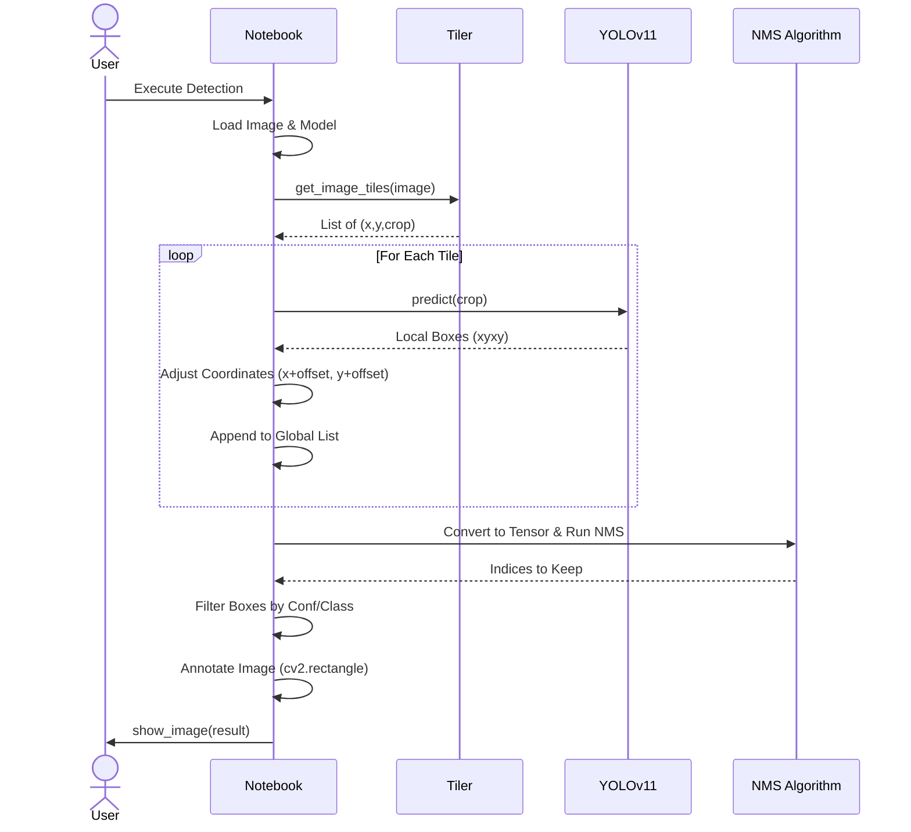

# Photo Processing Utilities

This repository contains tools and scripts for photo processing and effects.

## Disposable Camera Effect

The `disposable_camera.ipynb` notebook gives your digital images a nostalgic, disposable camera look.

### Features
*   **High ISO Noise/Grain**: Simulates the grainy texture of film.
*   **Soft Focus**: Adds a subtle blur characteristic of cheap plastic lenses.
*   **Color Grading**: Applies warm tones, faded colors, and specific color shifts (green/yellow/blue).
*   **Vintage Curves**: Flattens highlights and lifts shadows for a faded look.
*   **Vignetting**: Adds darker corners.
*   **Aspect Ratio**: Automatically crops to 4x6 or 6x4.

### Usage
Open the notebook and configure the `IMAGE_PATH` and `OUTPUT_FOLDER` in the "Configuration" section to process your images.

### Process Flow

```mermaid
sequenceDiagram
    actor User
    participant NB as Notebook
    participant Proc as ImageProcessor
    participant FX as EffectFunctions

    User->>NB: Run All Cells
    NB->>Proc: Load Image (cv2.imread)
    NB->>Proc: Determine Orientation & Crop
    
    rect rgb(30, 30, 30)
    note right of NB: Pipeline Execution
    NB->>FX: add_grain(image)
    FX-->>NB: noisy_image
    NB->>FX: add_softness(noisy_image)
    FX-->>NB: soft_image
    NB->>FX: apply_color_balance(soft_image)
    FX-->>NB: colored_image
    NB->>FX: apply_vintage_curves(colored_image)
    FX-->>NB: curved_image
    NB->>FX: apply_contrast(curved_image)
    NB->>FX: apply_vignette(contrast_image)
    FX-->>NB: final_image
    end

    NB->>NB: show_image(final_image)
    NB->>User: Display Result
```

## Object Detection

The `object_detection.ipynb` notebook demonstrates object detection on large images using YOLO models.

### Features
*   **YOLOv11 Integration**: Uses Ultralytics YOLO models (nano and x-large) for detection.
*   **Tiling Strategy**: Splits high-resolution images into tiles to improve detection accuracy on small objects.
*   **Non-Maximum Suppression (NMS)**: Merges detections from multiple tiles and removes duplicates.
*   **Inline Visualization**: Displays processed images with bounding boxes directly in the notebook using Matplotlib.

### Detection Workflow

